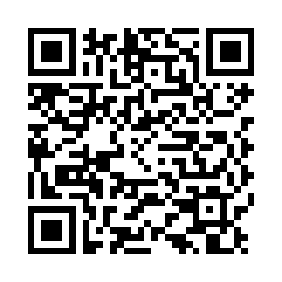

# Welcome to GatherSync! 🎉

**Your Personal Event Coordination Assistant**

Peter has invited you to test GatherSync - a new app designed to make coordinating group events easier. This app helps you find the perfect date when everyone is available.

---

## Quick Start Guide

### Step 1: Install Expo Go

**iPhone Users:**
1. Open the **App Store**
2. Search for **"Expo Go"**
3. Install the app (it's free)

**Android Users:**
1. Open the **Google Play Store**
2. Search for **"Expo Go"**
3. Install the app (it's free)

---

### Step 2: Open GatherSync

**Option A: Scan the QR Code** (Easiest!)

1. Open the **Expo Go** app
2. Tap **"Scan QR code"**
3. Point your camera at the QR code below:



**Option B: Enter URL Manually**

1. Open the **Expo Go** app
2. Tap **"Enter URL manually"** at the bottom
3. Copy and paste this URL:
   ```
   https://8081-ienb1rj930k0x92csc3x6-a41ba8ee.manus-asia.computer
   ```
4. Tap **"Connect"**

---

### Step 3: Log In to Enable Cloud Sync

1. When GatherSync opens, you'll see a **"Cloud Sync Available"** banner
2. Tap the **"Log In"** button
3. **Create an account** or use **OAuth** (Google/GitHub)
4. After logging in, you'll be redirected back to the app

---

### Step 4: Sync Your Events

1. You should now see **"Cloud sync enabled"** banner (green)
2. Tap the **"Sync Now"** button
3. Wait 10-20 seconds while syncing
4. **You should see 2 events appear:**
   - **AI Guys** - Monthly flexible event
   - **Guru Breakfast** - Monthly event

---

### Step 5: Mark Your Availability

**For Flexible Events (AI Guys):**
1. Tap on the **AI Guys** event
2. Find your name in the participants list
3. Tap on your name
4. Mark the dates you're **available** or **unavailable**
5. The app will help find the best date when most people can attend

**For Fixed Events (Guru Breakfast):**
1. Tap on the **Guru Breakfast** event
2. Find your name in the participants list
3. Tap on your name
4. Select your RSVP status:
   - ✅ **Attending**
   - ❌ **Not Attending**
   - ❓ **No Response** (default)

---

### Step 6: Sync Your Changes

After marking your availability or RSVP:

1. Go back to the **Events** list (tap the back arrow)
2. Tap **"Sync Now"** again
3. Your responses will be uploaded to the cloud
4. Everyone else will see your updates when they sync

---

## Important Tips

✅ **Always sync after making changes** - Your availability/RSVP won't be shared until you tap "Sync Now"

✅ **Sync regularly to see updates** - Other people's responses will appear when you sync

✅ **Keep Expo Go installed** - You'll need it to access GatherSync until we release the standalone app

✅ **Internet connection required** - Syncing requires an active internet connection

---

## Need Help?

If you encounter any issues:

1. **Force close and reopen** - Swipe up from app switcher and reopen Expo Go
2. **Check your internet connection** - Sync requires WiFi or mobile data
3. **Contact Peter** - He's testing this app and wants your feedback!

---

## What to Test

Peter would love your feedback on:

- ✅ Does the app load correctly?
- ✅ Can you see the events after syncing?
- ✅ Can you mark your availability/RSVP?
- ✅ Do your changes sync back to other users?
- ✅ Is the app easy to use?
- ✅ What features would make it more useful?

---

## Privacy & Data

- Your data is stored securely in the cloud
- Only members of your events can see your responses
- You can delete your account and data at any time
- This is a test version - please don't enter sensitive information

---

**Thank you for testing GatherSync!**

Your feedback will help make this app better for everyone.

*Questions? Contact Peter Scarfo*

---

© 2025 Peter Scarfo. All rights reserved.
